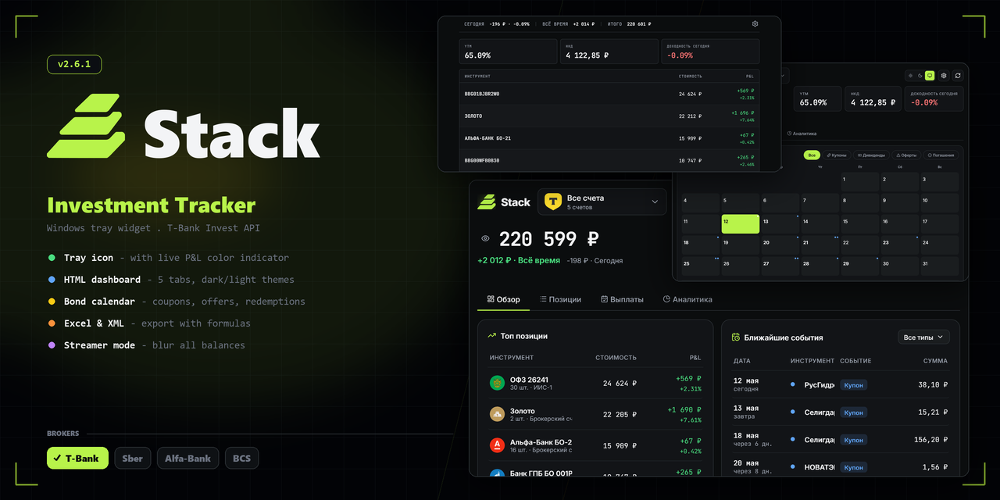

<div align="center">


# Stack

**Windows-виджет в трее для отслеживания инвестиционного портфеля**

[](https://www.python.org/)
[](https://www.microsoft.com/windows)
[](https://github.com/Damfler/Invest-Dekstop-Watcher/releases/latest)
[](LICENSE)

<a href="https://github.com/Damfler/Invest-Dekstop-Watcher/releases/latest">
  
</a>

---



</div>

## Что это

**Stack** живёт в системном трее Windows и показывает состояние твоего инвестиционного портфеля в реальном времени. Иконка меняет цвет в зависимости от текущего P&L, по левому клику открывается HTML-дашборд с подробной аналитикой: позиции, облигации, события (купоны/оферты/погашения), графики и фильтры по счетам.

Сейчас поддерживается **T-Bank Invest API**. Архитектура подготовлена для других брокеров.

## Возможности

| | |
|---|---|
| 🟢 **Трей-иконка** | Цвет отражает P&L: зелёный/красный/серый. При оферте — оранжевая, при оферте сегодня — мигающая красная |
| 📊 **HTML-дашборд** | 5 вкладок: Обзор, Позиции, Облигации, Аналитика, Настройки. Тёмная/светлая/системная тема |
| 📅 **Календарь событий** | Купоны, оферты, погашения с цветовой подсветкой и popup-деталями |
| 🥧 **Аллокация** | Doughnut-чарт по типам и по бумагам, валютная экспозиция |
| 💰 **Купонный поток** | Бар-чарт по месяцам на 12 месяцев вперёд |
| 🏦 **Мультисчета** | Сравнение, фильтрация, итоги по каждому счёту |
| 🔍 **Поиск и фильтры** | Поиск позиций, сортировка по 6 критериям, фильтры по типу |
| 📤 **Экспорт** | Excel (.xlsx с формулами) и XML, 2 листа |
| 🔔 **Уведомления** | Toast: оферты, купоны, движения портфеля |
| 🔄 **Автообновление** | Через GitHub Releases — одна кнопка, перезапуск автоматически |
| 🎬 **Режим стримера** | Размытие балансов одним кликом |
| ⌨️ **Горячие клавиши** | `Ctrl+R` обновить, `Esc` закрыть, `1-4` табы |
| 🪶 **Компактный режим** | Mono-таблица без лишних элементов — для повседневного использования |

## Установка

### 🚀 Готовый `.exe` — рекомендуется

1. [Скачай Stack.exe](https://github.com/Damfler/Invest-Dekstop-Watcher/releases/latest) из последнего релиза
2. Запусти — откроется мастер первого запуска
3. Создай токен в **Т-Инвестиции → Настройки → API → Создать токен** (только чтение)
4. Вставь токен в мастер, поставь галку «Запускать с Windows»

Пользовательские данные хранятся в `%APPDATA%\Stack\` (config, cache, logs). Само приложение — один `Stack.exe` ~50–80 МБ, без зависимостей.

### 🛠 Из исходников

```bash
git clone https://github.com/Damfler/Invest-Dekstop-Watcher.git
cd Invest-Dekstop-Watcher
pip install -r requirements.txt
python main.py
```

Для разработки положи токен в `.env`:
```
TBANK_TOKEN=t.твой_токен
```

## Конфигурация

`config.json` создаётся автоматически в `%APPDATA%\Stack\` (`.exe`) или рядом со скриптом (dev). Большинство параметров переключаются прямо из дашборда — раздел «Настройки» (шестерёнка в шапке).

| Параметр | Описание |
|----------|----------|
| `theme` | Тема дашборда: `system` / `dark` / `light` |
| `design` | Дизайн: `classic` / `simple` (компактный mono-режим) |
| `bond_horizon_days` | Горизонт событий облигаций (30–365 дней) |
| `notify_offer_days` | За сколько дней до оферты предупреждать |
| `notify_move_pct` | Порог % движения портфеля для уведомления |
| `auto_update` | Проверять обновления при старте |
| `use_logos` | Логотипы бумаг из CDN T-Bank |

## Архитектура

<details>
<summary>Структура проекта</summary>

```text
├── main.py              # Точка входа, мастер, инициализация
├── version.py           # APP_VERSION, APP_NAME
├── constants.py         # Таймеры, алерты, список брокеров
├── core/
│   ├── app.py           # StackTrayApp — координатор pystray + pywebview
│   ├── data_store.py    # Потокобезопасное хранилище с snapshot()
│   ├── config.py        # Загрузка/сохранение config.json
│   └── cache.py         # Кэш данных + история портфеля
├── api/
│   ├── client.py        # T-Bank REST-клиент (retry, rate-limit)
│   └── endpoints.py     # URL эндпоинтов
├── ui/
│   ├── window.py        # Менеджер pywebview-окна + JS API
│   ├── menu.py          # Callable-меню pystray
│   ├── wizard.py        # Мастер первого запуска
│   └── icons.py         # Иконки трея (Pillow + PNG из assets/)
├── utils/
│   ├── formatting.py    # Форматирование чисел/дат
│   ├── analytics.py     # YTM, аллокация, top-movers, cashflow
│   ├── notifications.py # Toast-уведомления (plyer)
│   ├── autostart.py     # Реестр Windows для автозапуска
│   └── updater.py       # GitHub Releases auto-update
├── assets/
│   ├── dashboard.html   # HTML-дашборд (Chart.js + Lucide)
│   └── icons/           # Логотип, state-иконки трея
└── tools/
    ├── gen_icons.py             # Генератор иконок из logo.svg
    └── gen_social_preview.py    # GitHub Social Preview
```

</details>

<details>
<summary>Стек</summary>

- **Python 3.13+** — основной язык
- **pystray** + **Pillow** — иконка в трее, генерация спрайтов
- **pywebview** (Edge WebView2) — окно дашборда
- **requests** — REST-клиент T-Bank
- **plyer** — нативные toast-уведомления Windows
- **openpyxl** — Excel-экспорт с формулами
- **Chart.js** + **Lucide** + **html2canvas** — фронт (CDN)
- **resvg-py** — SVG-рендеринг иконок (build-time)
- **PyInstaller** — сборка в один `.exe`

</details>

## Сборка `.exe`

```bash
build.bat
# или напрямую:
python -m PyInstaller stack.spec --noconfirm --clean
```

Результат — `dist/Stack.exe`. Все ресурсы (HTML, иконки) упакованы внутрь.

## Иконки

Все state-иконки трея (`positive.png` / `negative.png` / `neutral.png` / `warn.png` / `crit.png`) генерируются из одного `assets/icons/logo.svg`:

```bash
python tools/gen_icons.py             # всё: PNG-иконки + .ico
python tools/gen_icons.py --states    # только трей-состояния
python tools/gen_icons.py --brand     # только icon.png + icon.ico
```

Иконки рендерятся через `resvg-py` (нативный Rust-рендерер, без cairo) с перекраской по альфа-каналу и наложением на squircle-фон нужного цвета. Хочешь свой цвет? Поправь `PRESETS` в `tools/gen_icons.py`.

## GitHub Social Preview

Превью-картинка для шаринга репозитория (1280×640). Использует реальные скриншоты приложения из `assets/mockups/` если они есть, иначе рисует мокап средствами Pillow.

```bash
python tools/gen_social_preview.py            # en (по умолчанию)
python tools/gen_social_preview.py --locale ru
python tools/gen_social_preview.py --all      # обе локали сразу
```

Скриншоты сохраняются прямо из приложения: вкл `Dev-режим` в настройках → нажми иконку 📷 в шапке на нужном экране.

**Загрузка в репо:** `Settings → Options → Social preview → Edit → Upload image`.

## Поддерживаемые брокеры

| Брокер | Статус |
|--------|--------|
| 🟢 **Т-Банк (T-Invest)** | Готово |
| 🟡 Сбер Инвестиции | В планах |
| 🟡 ВТБ Мои Инвестиции | В планах |
| 🟡 Альфа-Инвестиции | В планах |
| 🟡 БКС Мир Инвестиций | В планах |

Структура подготовлена в `constants.BROKERS` + `wizard.py`. Чтобы добавить брокера — реализуй `api/client.py`-совместимый класс и добавь `elif broker == "xxx"` в `main.py`.

## Разработчик

**Гашук Дмитрий**

<a href="https://pay.cloudtips.ru/p/789f174f">
  
</a>

---

<div align="center">
<sub>Сделано с ❤ в Москве · 2026</sub>
</div>
